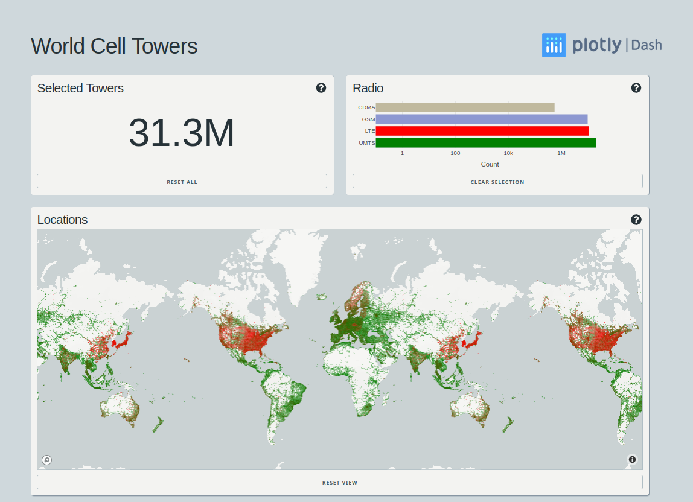
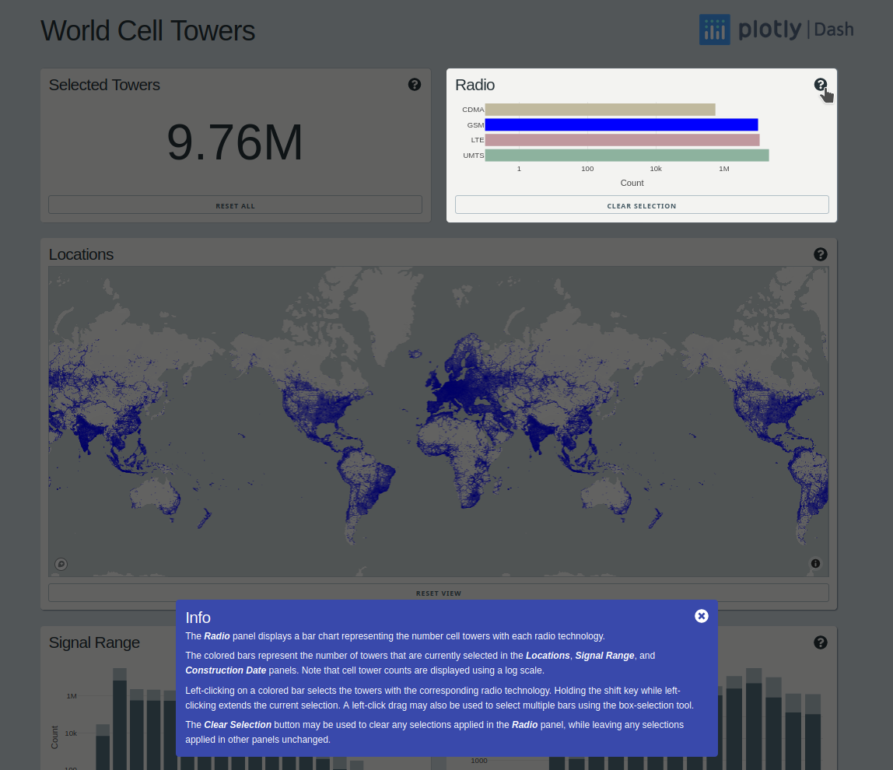

## World Cell Towers Dash App (DASK CPU vs RAPIDS GPU)


This repo contains a Python [Dash](https://dash.plot.ly) app for exploring the world
cell tower dataset provided by [OpenCellid](https://www.opencellid.org/).

## Technical Details
This dataset contains over 40 million rows of data, each row including several cell
tower features in addition to the latitude/longitude location of the tower.
To handle this fairly large dataset, this app makes use of
[Dask](https://dask.org/) for parallel processing, and
[Datashader](https://datashader.org/) for server side rendering. 

## cudf setup

```bash
git clone https://github.com/AjayThorve/dash-world-cell-towers.git
cd dash-world-cell-towers
mkdir data
cd data
#download data from source
cd ../

conda create -n test_environment

conda install -c rapidsai -c nvidia -c conda-forge \
    -c defaults cudf=0.12 python=3.7 cudatoolkit=10.0 pyarrow

conda update -n test_environment --file requirements.txt
    
```

## Environment
First, create a virtualenv or conda environment that includes the dependencies listed
in the `requirements.txt` file.

## Data setup
Due to storage constraints, this repository does not include the cell towers dataset.
Instead, the `notebooks/prepare_cell_data.ipynb` Jupyter notebook contains instructions
for downloading the raw data, and the notebook itself will process the data set and
write out a compressed parquet file to the `./data` directory.

Alternatively, download the `cell_towers.parq.zip` file from Google drive at
https://drive.google.com/open?id=1mOZq24EFI0eNC2xtVEFQyPxVPHLZI9QN, then unzip it as
`cell_towers.parq` (even though it has a file extension, this will be a directory)
and place it at `data/cell_towers.parq`. 


## Data setup for cudf
the `notebooks/prepare_cell_data.ipynb` Jupyter notebook contains instructions
for downloading the raw data, and the notebook itself will process the data set and
write out a compressed arrow file to the `./data` directory

## Mapbox setup
To run the dashboard, create a file name `.mapbox_token` under to root directory. This
file should contain a valid Mapbox token, which can be obtained for free by setting up
an account at https://www.mapbox.com/.

## Dask setup
By default, this dashboard creates a Dask `LocalCluster`. To change this Dask
configuration, edit the Dask options at the top of the `app.py` file.

## Launching Dashboard
Launch the dashboard in development mode from the command line with...
```
$ python app.py
```

For the gpu version powered by rapids cudf(https://github.com/rapidsai/cudf)

```
$ python app_gpu_cudf.py
```

Then open the dashboard at the URL displayed by the command.

## Preview
Initial dashboard view:


Click on *Radio* panel bars to select cell towers by radio technology:


Drag to select the towers with the longest range using the *Signal Range* panel. As in
this case, when the active selections result in fewer than 5000 towers, the map view
switches from using Datashader to displaying towers using a `scattermapbox` scatter
trace that includes tooltips with detailed information about each individual tower.   


Documentation for each panel can be activated by clicking on the question mark icon in
the top right corner of the panel.  Documentation appears in a second floating panel,
and the panel that is being described is highlighted. The documentation panel is closed
by clicking the close icon in the top right corner of the documentation panel.  



